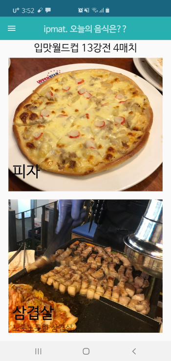
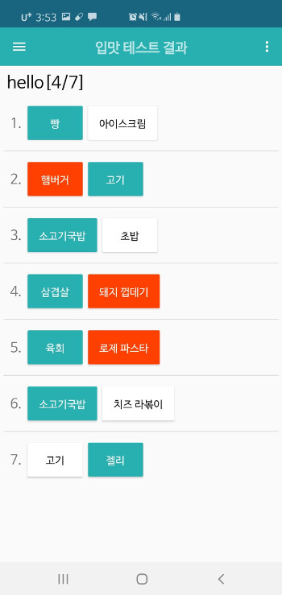

# ipmat_server

## 입맛에 끌리는 음식 추천 및 자신의 입맛을 바탕으로한 문제지 만들기

## 기술 스택

-   Python Django
-   AWS
    -   EC2 Instance
    -   RDS
    -   S3
-   MySQL
-   Android Studio Java
-   Docker, ECR
-   Nginx

## Application Structure

### Server

`Django`를 바탕으로 `API Server`을 구축한다. 이 1API Server`를 통해 Android Application과 소통한다.

`Django`는 `AWS RDS`의 `MySQL` DB를 이용한다.

AWS의 ECR을 이용해 이미지를 만들고 손쉽게 django server을 run

docker run --name -d ipmat-server -p 8001:8000

## Requirements

`pip install -r requirements.txt` python 모듈은 `requirements.txt`에 기록된 목록을 이용해 설치한다.

사용하는 Environmental virables는 `.env`, `.production.env` 이고, 이 두 파일은 `ipmat-upload` 버킷에 프라이빗하게 업로드 해두었다. 혹시라도 이 파일들을 완전히 분실하게 된다면 골치아프겠지만, 이러한 상황을 대비해 S3 버킷에 업로드해둔 것이다.`.env`와 `.production.env`는 private repository라도 **추후에 public으로 바꿀 때를 대비해 Github에 공개하지 말 것**

`sudo apt install docker.io awscli`

`sudo usermod -aG docker $USER` 이 커맨드 후에 로그아웃했다가 쉘에 접속해야 권한이 제대로 적용된다.

`aws configure` 을 통해 `ECR`에 Pull이 가능한 `IAM User`을 추가해준다.

## How to run the server

`aws configure`후에 `$(aws ecr get-login --no-include-email)` 을 통해 ECR에 접근할 수 있도록 로그인한다.

1. detach 모드로 host의 8001번포트와 컨테이너의 8000번 포트를 바인딩시킨다. 이 때의 IPMAT_MODE=production (Image으 ENV를 따름)

`docker run -d --name ipmat --rm -p 8001:8000 325498511266.dkr.ecr.ap-northeast-2.amazonaws.com/ipmat-server:stable`

2. DEBUGGING을 원하는 경우 detach모드를 해제하고, env를 IPMAT_MODE=development로 override

`docker run --name ipmat --rm -p 8001:8000 --env IPMAT_MODE=development 325498511266.dkr.ecr.ap-northeast-2.amazonaws.com/ipmat-server:stable`

## 업데이트 내용

-   #### 20190826

    nav와 action bar, toolbar 등의 설정을 Activity 마다 복붙형식으로 했었는데, 이를 DrawerSetter 클래스를 정의하여 깔끔하게 구현해놓음

    Exam Delete 기능을 추가함

-   #### 20190828

    난잡하게 LinearLayout과 ImageView를 겹쳐서 진행하던 FoodExam을 CardView를 이용해서 깔끔하게 정리함.

    Instagram 먹킷리스트 유저들과 연결해서 Food Images 가져옴

-   #### 20190830

    cardView를 통해 깔끔하게 정리하고 food_name 잘 보이게 수정. RoundCorner, Shadow 적용함.

-   #### 20190902

    Logo 와 Icon 및 디자인 조금 더 깔끔하게 변경

-   #### 20190905

    s3와 Django Backend를 연동함

-   #### 20190907

    FoodBookList 자체가 클릭 이벤트 받게 고침.

    ExamList Delete, ExamDetail Login, Singup 등등의 Activity에서 불필요하게 Activity가 남겨지던 것들 정리

    ParticipantCount, FoodBookPlayCount 반영함.

-   #### 20190908

    두 개의 액티비티에 Admob을 달았음.

    Worldcup 진행 시 인스타 아이디가 아래쪽은 바뀌지 않는 버그가 있었는데, 그거랑 자잘한 버그 수정.

-   #### 20190909

    마지막 Activity인 경우 Back press 2번하게 수정함.

    sub_image와 sub_creator 추가함.

    **출시**

-   #### 201910

    docker-compose를 이용해 nginx와 묶어봄.

-   #### 202002

    서버를 이전하는 과정에서 이 프로젝트의 경우 Docker을 이용하는 데에 적절하도록 구조가 잡혀있었기에, 서버 컴퓨터의 구조를 더럽히지 않고 간단히 docker를 이용하기로 결정.

    ECR을 통해 Private repository를 이용한다.

## 피드백

-   ~~전체적인 디자인 깔끔하게~~
-   ~~Food WorldCup 진행 시 카드 형식을 그림자랑 Round Corner로~~
-   ~~Fodd WorldCup 음식이름 색 안보이는 거 수정~~
-   AlertBox에 Layout xml 적용하는 방법
-   SetPreferences 나 session key 관리 부분을 좀 더 확실히 하기.
-   ~~s3 와 django storage 연동하기~~
-   s3 Bucket을 Nginx reverse proxy로 설정해서 한 호스트를 통해 이용가능하게 할까?
-   Fragment View로 갈아타볼까
-   이미지와 creator 여러명 넣을 수 있게하기.
