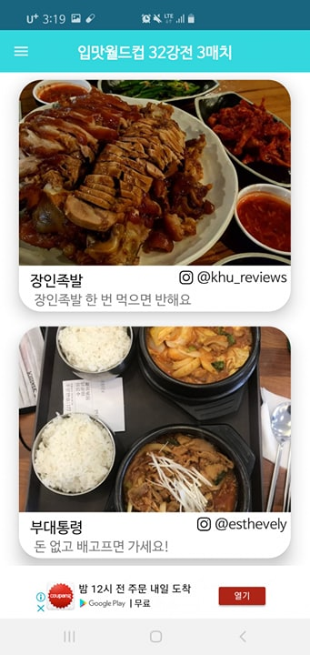
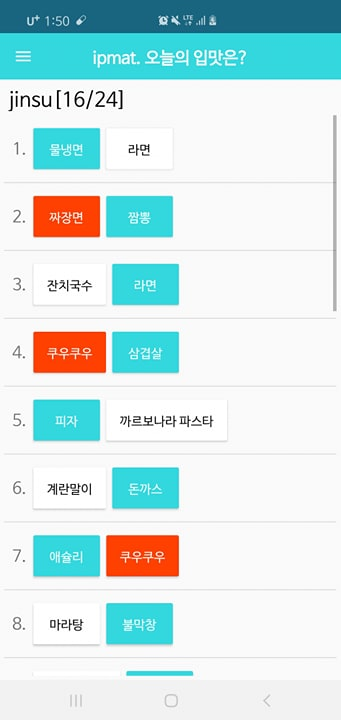

# ipmat_server

입맛에 끌리는 음식 추천 및 자신의 입맛을 바탕으로한 문제지 만들기

## 업데이트 내용

* #### 0826

  nav와 action bar, toolbar 등의 설정을 Activity 마다 복붙형식으로 했었는데, 이를 DrawerSetter 클래스를 정의하여 깔끔하게 구현해놓음 

  Exam Delete 기능을 추가함

* #### 0828

  난잡하게 LinearLayout과 ImageView를 겹쳐서 진행하던 FoodExam을 CardView를 이용해서 깔끔하게 정리함.

  Instagram 먹킷리스트 유저들과 연결해서 Food Images 가져옴

  0826

  nav와 action bar, toolbar 등의 설정을 Activity 마다 복붙형식으로 했었는데, 이를 DrawerSetter 클래스를 정의하여 깔끔하게 구현해놓음 

  Exam Delete 기능을 추가함

* #### 0830

  cardView를 통해 깔끔하게 정리하고 food_name 잘 보이게 수정. RoundCorner, Shadow 적용함.

* #### 0902

  Logo 와 Icon 및 디자인 조금 더 깔끔하게 변경

* #### 0905

  s3와 Django Backend를 연동함

* #### 

## 피드백

* ~~전체적인 디자인 깔끔하게~~
* ~~Food WorldCup 진행 시 카드 형식을 그림자랑 Round Corner로~~
* ~~Fodd WorldCup 음식이름 색 안보이는 거 수정~~
* AlertBox에 Layout xml 적용하는 방법
* SetPreferences 나 session key 관리 부분을 좀 더 확실히 하기.
* ~~s3 와 django storage 연동하기~~

## 기술 스택

* Python Django
* AWS
  * EC2 Instance
  * RDS
  * S3
* MySQL
* Android Studio Java

## App Structure

### Server

`Django`를 바탕으로 `REST API`방식을 이용해 Android Application과 소통한다.

`Django`는 `AWS RDS`의 `MySQL` DB를 이용한다.

